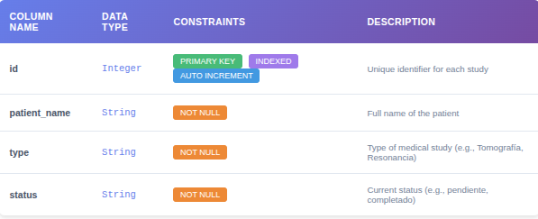

# Backend - Medical Studies Dashboard

Backend implementado para el challenge usando FastAPI y SQLite.

Se uso como plantilla base un repo propio: https://github.com/ricardolcv27/fastapi-lite

## Herramientas usadas

- **FastAPI** - Framework web moderno y rápido
- **SQLite** - Base de datos ligera (archivo `studies.db`)
- **SQLAlchemy** - ORM con soporte async
- **Docker + Docker Compose** - Desarrollo containerizado
- **Middlewares** - CORS y logging configurados
- **Pydantic** - Validacion de datos
- **pytest** - Tests de integracion

## Estructura del proyecto

```
backend/
├── main.py                 # Punto de entrada + middlewares
├── app/
│   ├── api/
│   │   ├── api.py           # Router principal
│   │   └── endpoints/
│   │       └── studies.py   # Endpoints de estudios
│   ├── core/
│   │   ├── config.py        # Configuración (env vars)
│   │   ├── errors.py        # Manejo de errores en la app
│   │   └── middleware.py    # Middlewares CORS y logging
│   ├── crud/                # Lógica de acceso a datos
│   │   └── studies.py
│   ├── db/
│   │   ├── base.py          # Base de SQLAlchemy
│   │   └── session.py       # Engine async + get_session
│   ├── models/              # tablas
│   │   └── studies.py
│   └── schemas/             # DTOs
│       └── studies.py
├── tests/                   # Tests
│   ├── conftest.py          # Fixtures y configuración
│   └── test_studies.py
├── Dockerfile
├── docker-compose.yml
├── requirements.txt
├── Makefile                 # Comandos útiles
├── studies.db               # Base de datos SQLite (auto-generada)
└── .env.example
```

## Endpoints
### POST /studies
Agregar un nuevo estudio.

### GET **/studies**?offset={*offset*}&limit={*limit*}
Listar los estudios. Le agregue **paginacion**, por defecto el `offset = 0` y `limit = 5`. Ya que no es una buena practica que un endpoint GetAll devuelva todos los elementos. Ya que puede existir un gran volumen de registros y el sistema puede saturarse al devolver todos en un solo llamado. En este challenge pequeno no ocurre, pero a gran escala la cantidad de elementos devueltos puede convertirse en un problema.

### GET /studies/metrics
Devuelve la cantidad de estudios pendientes, completados y totales. No agregue esta informacion al endpoint `GET /studies` ya que estaria rompiendo el contrato de lo que debe de devolver el endpoint `GET /studies` que esta en el enunciado.

## Levantar backend

Se puede levantar usando docker pero igualmente se puede levantar localmente sin necesidad de docker.

Opcionalmente tambien se puede crear un `.env` si desea cambiar algunas variables de entorno

```bash
cp .env.example .env

# Editar .env si es necesario
```

### 1. Levantar con Docker Compose

```bash
docker-compose up --build
```

El server se econtraria corriendo en:
- **API**: http://localhost:8000

O en el host o puerto colocado en el .env

### 2. Desarrollo local (sin Docker)

```bash
python3 -m venv .venv
```
```bash
source .venv/bin/activate
```
```bash
pip install -r requirements.txt #o make install
```
```bash
uvicorn main:app --reload #o make dev
```

## Base de datos

Se utilizo SQLite.

### Modelado de tabla

Se creo una unica tabla `studies` que almacena los estudios hechos.



La tabla se crean automaticamente al iniciar la aplicacion.


### Resetear la base de datos

```bash
# Detener la app
# Borrar la base de datos
rm studies.db
# Iniciar denuevo la app (se recreara denuevo la base de datos)
make dev
```

## Comandos útiles (Makefile)

```bash
make help       # Ver todos los comandos disponibles
make install    # Instalar dependencias
make dev        # Iniciar servidor en desarrollo
make up         # Levantar Docker Compose
make down       # Detener Docker Compose(cache, db)
make test       # Ejecutar tests
make lint       # Ejecutar linters (flake8)
```

## Middlewares configurados

### CORS
Actualmente permite todas las origins (`*`) para desarrollar y probar el challenge. Lo ideal para produccion hay que editarlo:

```python
#app/core/middleware.py
app.add_middleware(
    CORSMiddleware,
    allow_origins=["http://localhost:3000"],  # Cambiar aca
    allow_credentials=True,
    allow_methods=["GET", "POST"],
    allow_headers=["*"],
)
```

### Logging
Logea todas las peticiones HTTP

## Testing

Los tests usan SQLite en memoria.

```bash
# Ejecutar todos los tests
make test

# O directamente con pytest
PYTHONPATH=. pytest tests/ -v 
```

### Estructura de tests

- `tests/conftest.py`: Configura los fixtures (BD en memoria, cliente HTTP)
- `tests/test_studies.py`: Tests de endpoints de `/studies`

Los tests son completamente independientes y cada uno usa su propia base de datos limpia.

## Variables de entorno

Copiar `.env.example` a `.env` y ajustar:

```bash
PORT=8000
HOST=0.0.0.0
```

## Aclaraciones y mejoras
- Agregue un endpoint mas `GET /studies/metrics` para obtener la cantidad de estudios totales, pendientes y completados.
- **Mejora**: Mejorar modelado de tablas para que sea mas escalable.
- **Mejora**: Implementar migraciones con Alembic.
- **Mejora**: Cambiar SQLite por PostgreSQL en producción para persistencia en disco.
- **Mejora**: agregar CI/CD pipelines.
